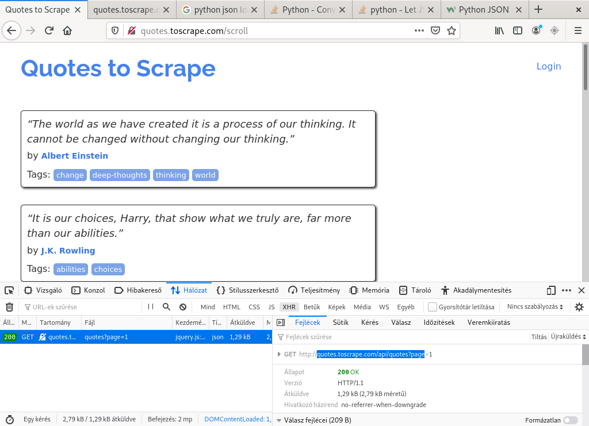
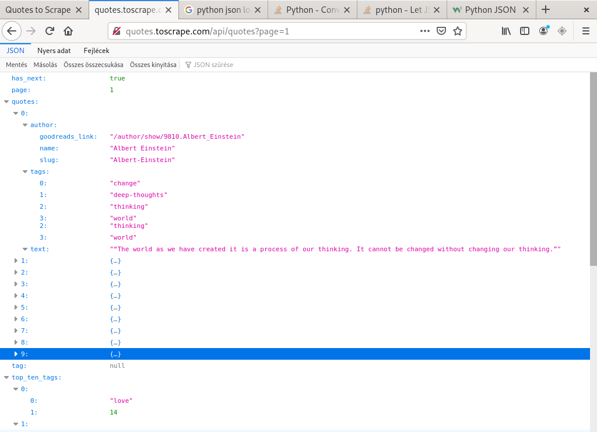
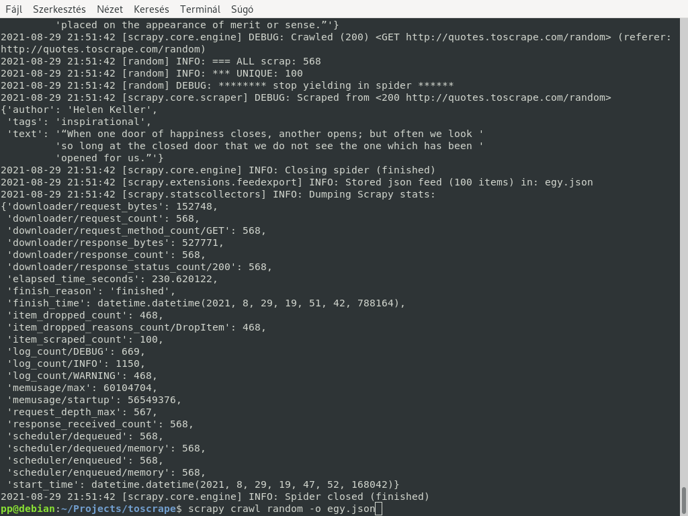

# toscrape

## img crawler

Download images from books.toscrape.com using the Images pipeline.
The name of the downloaded images is a serial number that corresponds to their position in the catalog. Like: 0001.jpg, 0002.jpg ...
You can change where the download starts, so how many images are downloaded, by rewriting the start_urls = variable. See: toscrape/spiders/img.py

To run, enter:


```
$ scrapy crawl img
```

The download location will be the downloads/files folder. (settings.py)

## control crawler

The middleware controls the crawl and stops it if the "CONTROL_XPATH" condition is false. Once you have done the necessary things with the browser - in this case following a link - the crawl will continue after you hit Enter. Selenium with Firefox.

```
$ scrapy crawl control -o books.csv
```

## login crawler

Crawl & scrap quotes from quotes.toscrape.com/login
Programmed login.

```
$ scrapy crawl login
```

## scroll crawler

Scrape a web page that operates with infinite scroll. http://quotes.toscrape.com/scroll
The API needs to be extracted! 


Which in this case is in JSON format: 


It's pretty simple.

```
$ scrapy crawl scroll -o quotes.json
```

## random crawler


Scrape off all random quotes from http://quotes.toscrape.com/random . Keeps only unique quotes. The website contains 100 citations. It takes about five hundred request-s for all citations to be queued. 



But scraping can be safely interrupted with the Ctrl-C key. It is recommended to press it only once. In this case, the contents of the output file are not lost either.

```
$ scrapy crawl random -o egy.json
```
